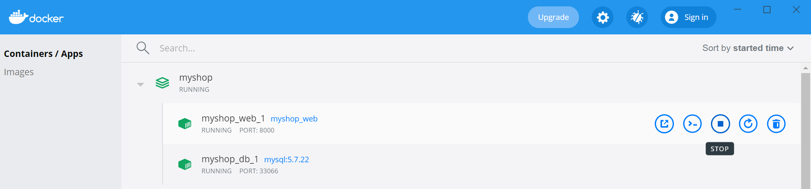

# Arquitectura Model-View-Template

## Estructura del Directorio

- myshop: Directorio que almacena el código fuente del Sistema MyShop.
- docs: Directorio que almacena documentos auxiliares para este archivo.

## Sistema MyShop

MyShop es una tienda online que permite a los clientes navegar a través de un catálogo de productos, agregar productos a un carrito de compras, pagar el carrito y realizar un pedido. La confirmación y los datos del pedido se informan a los clientes vía email. Regularmente, el envío de los artículos de un pedido se realiza 30 horas después de haber confirmado el pedido.

A continuación se muestra una vista estática del diseño del sistema MyShop:


## Prerrequisitos
- Clonar el repositorio:
   ```shell
   $ git clone https://gitlab.com/tareas-arquitectura-de-software-curso/modelo-vista-template.git

   $ cd modelo-vista-template

   $ cd myshop

   ```

- Instalamos Docker. La manera recomendada para implementar este sistema es utilizando [Docker](https://www.docker.com/), para instalarlo puedes seguir las instrucciones para cada sistema operativo haciendo clic [aquí](https://docs.docker.com/install/).

Antes de continuar con los siguientes comandos es necesario tomar en cuenta que las pruebas se realizaron bajo la versión 20.10.5 de Docker, a la cual le corresponde la versión 3.8 del archivo docker-compose. Para evitar algún inconveniente, es necesario revisar la versión que corresponda y modificarla en el archivo docker-compose.yml de acuerdo con la versión que se instale de Docker, esta información se puede consultar [aquí](https://docs.docker.com/compose/compose-file/compose-versioning/).

- Una vez instalado docker podemos ejecutar el siguiente comando (verificar que el servicio de Docker se encuentra corriendo):

    ```shell
    $ docker-compose up -d db
    ```

    En linux:

    ```shell
    $ sudo docker-compose up -d db
    ```

    Este comando correrá el contenedor de docker con la base de datos a utilizar en el sistema de compras myshop, el cual seguirá corriendo en background hasta que sea detenido explícitamente.


- Si este comando no se ejecuta correctamente y el contenedor aparece que se encuentra reiniciando constantemente, es posible que la razón sea que se está trabajando dentro de una carpeta compartida de una máquina virtual. Si este es el caso, deberá seguir los siguientes pasos para dar solución al problema.


    1. Dentro de nuestra carpeta myshop, vamos a mover el archivo docker-compose.yml fuera de la carpeta compartida con el siguiente comando:

        ```shell
        $  sudo mv docker-compose.yml ~
        ```
    
    2. Nos movemos hacia la carpeta en donde movimos el archivo docker-compose.yml:

        ```shell
        $  cd ~
        ```

    3. Editamos el archivo utilizando el programa nano:

        ```shell
        $  nano docker-compose.yml
        ```
    
    4. Modificamos las siguientes líneas dentro del servicio 'web':

        - context: /<path_shared_folder>/modelo-vista-template/myshop/
        - /<path_shared_folder>/modelo-vista-template/myshop/:/app
    
    5. Modificamos las siguientes líneas dentro del servicio 'db':

        - /<path_shared_folder>/modelo-vista-template/myshop/.docker/setup.sql:/docker-entrypoint-initdb.d/setup.sql
        - Borramos la línea: - .dbdata:/var/lib/mysql

    6. Con estas modificaciones volvemos a ejecutar el comando 'sudo docker-compose up -d db' y se debe construir sin problema el contenedor.

- Para el correcto funcionamiento del sistema es necesario crear la base de datos, para esto debemos abrir una conexión con el contenedor de mysql, para lograrlo escribimos en la consola lo siguiente:

    ```shell
    $  docker-compose exec db sh
    ```

    En linux:
    
    ```shell
    $ sudo docker-compose exec db sh
    ```

- Otra forma de hacerlo es desde el cliente de docker, seleccionando la opción CLI del contenedor myshop_db como se muestra en la imagen:

    <p align="center">
        
    </p>

    Con la conexión abierta, ingresamos a la base de datos con el siguiente comando, indicando el usuario y la contraseña (user = root, password = root):

    ```shell
    $  mysql -u root -p
    ```
    Dentro de mysql, verificamos que se encuentre creada la base de datos 'myshop' con el siguiente comando:

    ```shell
    mysql>  SHOW databases;
    ```

    De no ser así, ejecutamos el siguiente comando para crearla:

    ```shell
    mysql>  CREATE DATABASE myshop CHARACTER SET utf8mb4 COLLATE utf8mb4_general_ci;
    ```

   Si la operación fue exitosa, salimos de mysql y cerramos la conexión con el contenedor escribiendo 'exit' y dando click en el botón enter o simplemente cerrando la consola.

- Antes de iniciar el contenedor de la aplicación django debemos realizar algunos pasos previos. 

    1. Nos dirigimos al archivo myshop/myshop/.env y modificamos los siguientes campos:
        - EMAIL_HOST_USER
        - EMAIL_HOST_PASSWORD
        - DEFAULT_FROM_EMAIL
        
        Esta información es importande debido a que la aplicación envía un correo electrónico cuando se genera una orden, para que esto funcione correctamente es necesario que añada esta información (utilizando un correo gmail).
    
    2. Modificamos la línea 88 del archivo myshop/orders/views.py, en donde se encuentra la etiqueta '<your_email>' colocamos nuestro correo de gmail (el mismo correo agregado en la variable EMAIL_HOST_USER en el archivo .env).

        Ahora que se ha completado el archivo .env procederemos a realizar algunas configuraciones en su cuenta gmail para que permita el envío de correos electrónicos.

    3. Iniciamos sesión en el correo gmail del cual ingresó la información en el archivo .env.

    4. Damos click en nuestro usuario y seleccionamos la opción 'Gestionar tu cuenta de Google'.

    <p align="center">
        
    </p>

    5. En el menú que se encuentra en el lado izquierdo seleccionamos la opción de 'Seguridad'.

    <p align="center">
        
    </p>

    6. Navegamos hasta encontrar el apartado 'Acceso de aplicaciones poco seguras', si se encuentra desactivada la opción, procedemos a activarla.

    <p align="center">
        
    </p>

    Nota: Al realizar estos pasos quedaría lista la configuración, posiblemente llegue a su bandeja de correo un email indicando el inicio de sesión, eso se debe a que la aplicación django está haciendo uso de su cuenta para el envío de correos.

    Al momento de subir el proyecto a un repositorio recomendamos remover las credenciales del archivo .env.


- Ahora procederemos a iniciar el servicio de la aplicación django, para esto ejecutamos el siguiente comando:

    ```shell
    $ docker-compose up -d web
    ```

    En Linux:

    ```shell
    $ sudo docker-compose up -d web
    ```

    Este comando levantará el contenedor de docker con el sistema de compras myshop, el cual seguirá corriendo en background hasta que sea detenido explícitamente.

- Si el comando anterior se ejecutó con éxito, procederemos a aplicar las migraciones necesarias para django. Esto lo realizamos de la siguiente manera:

    Primero nos conectamos al contenedor myshop_web de la misma forma en que nos conectamos al contenedor de mysql. Ejecutamos el siguiente comando en una terminal:

    ```shell
    $ docker-compose exec web sh
    ```

    En Linux:

    ```shell
    $ sudo docker-compose exec web sh
    ```

    Después de conectarnos, ejecutaremos los siguientes comandos:

    ```shell
    $ python manage.py makemigrations

    $ python manage.py migrate
    ```

- Si en la construcción del contenedor de la base de datos se tuvieron problemas por utilizar una carpeta compartida, se deberán realizar los siguientes pasos para que los datos se importen de manera correcta en el sistema.

    1. Entrar al contenedor de la base de datos con el siguiente comando:
    
        ```shell
        $ sudo docker-compose exec db sh
        ```
    2. Dentro del contenedor, ejecutar el siguiente comando e indicar la contraseña (root) cuando se solicite:

        ```shell
        $ mysql -u root -p myshop < /docker-entrypoint-initdb.d/setup.sql
        ```
 
    3. Si se realizaron con éxito, podemos continuar con el siguiente paso y el sistema deberá funcionar con normalidad.


- Si el comando fue exitoso, podremos ingresar a nuestro navegador y verificar que el sistema se ha iniciado con éxito, para esto, ingresamos a la siguiente url: 

   > http://localhost:8000/

    Cerramos la conexión con el contenedor escribiendo 'exit' y dando click al botón enter o simplemente cerrando la consola.

- Otra manera de acceder al sistema myshop desde nuestro navegador es desde el cliente de Docker, dando click en el botón 'Open in Browser' del contenedor myshop_web como se muestra en la imagen:

    <p align="center">
        
    </p>

- Si todo funcionó correctamente debemos poder ver la siguiente pantalla que muestra el sistema MyShop:

    <p align="center">
        
    </p>

- Nota: cada vez que realicemos cambios en nuestra aplicación django, los veremos reflejados de forma casi inmediata (siempre y cuando los contenedores Docker se encuentren en ejecución), esto debido a las configuraciones que se agregaron en el archivo docker-compose. Por esta razón para estar probando nuestro sistema en desarrollo no sería necesario realizar los siguientes pasos. Sin embargo, son añadidos como una opción extra para el desarrollo del sistema.


## Desarrollo

- Es necesario contar con python 3.9 o superior y pip3 (las pruebas fueron realizadas con la versión 3.9.1). Se recomienda utilizar [pyenv](https://github.com/pyenv/pyenv) como manejador de versiones de python; una vez instalado se pueden seguir los siguientes comandos para instalar la versión deseada de python, esto hay que realizarlo en la raíz del repositorio:

   ```shell
   $ pyenv install 3.9.1
   $ pyenv local 3.9.1
   ```

- Crear un ambiente virtual para manejar las dependencias ejecutando:
   
   ```shell
   $ python3 -m venv venv
   ```

   en Windows:

   ```shell
   $ python3 -m venv venv
   ```

   si no funciona el comando anterior, ejecutar el siguiente:
   ```shell
   $ py -3 -m venv venv
   ```

   Esto creará una carpeta llamada "venv" que representa nuestro ambiente virtual y donde instalaremos todas las dependencias.

- Activamos el ambiente virtual:
   ```shell
   $ source venv/bin/activate
   ```

   o en Windows:
   ```shell
   $ venv\Scripts\activate
   ```

- Instalamos las dependencias del microservicio ejecutando:
   ```shell
    (venv)$ cd myshop 

    (venv)$ pip3 install -r requirements.txt 
   ```

   Los paquetes que se instalarán son los siguientes:

    Paquete              |  Versión  | 
   ----------------------|-----------|
    django               |   3.1.7   |
    mysqlclient          |   2.0.3   |
    django-mysql         |   3.9     |
    django-environ       |   0.4.5   |
    django-cors-headers  |   3.5.0   |
    Pillow               |   8.1.1   |
    Celery               |   5.0.5   |

- Si alguno de los requerimientos necesarios no se instala correctamente, deberemos proceder a instalarlos manualmente como en el siguiente ejemplo de instalación de mysqlclient:

   ```shell
    (venv)$ pip3 install mysqlclient==2.0.3
   ```

- Nota importante: Debemos recordar que al no estar trabajando dentro de los contenedores, necesitaremos tener el manejador de MySql instalado en nuestra máquina local y la base de datos myshop. Además deberemos cambiar las configuraciones necesarias de la base de datos del archivo .env. Por esta razón se recomienda utilizar los contenedores de Docker incluso en tiempo de desarrollo.


### Ejecución del sistema en desarrollo

- Dentro del directorio de myshop (en donde se encuentra el archivo manage.py) ejecutamos el siguiente comando:
   ```shell
   (venv)$ python manage.py runserver 0.0.0.0:8000 

   ```

- Si el comando fue exitoso, podremos ingresar a nuestro navegador y verificar que el sistema se ha iniciado con éxito, para esto, ingresamos a la siguiente url: 

   > http://localhost:8000/

Nota: Recordar que en este caso estamos probando el sistema sin la ayuda del contenedor de Docker. Esta ejecución se recomienda realizarla solamente durante desarrollo.


## Comandos Docker

- Para iniciar nuestros contenedores debemos ejecutar los siguientes comandos:

    ```shell
    $ docker-compose up -d db
    ```
    
    ```shell
    $ docker-compose up -d web
    ```

    En Linux:

    ```shell
    $ sudo docker-compose up -d db
    ```

    ```shell
    $ sudo docker-compose up -d web
    ```

    De esta forma podremos acceder al sistema myshop desde nuestro navegador.

    Nota: Si se realizaron con éxito los pasos indicados en los prerrequisitos, no es necesario volver a iniciar los contenedores, esto solo se debe realizar en caso de que los contenedores se encuentren detenidos.

- Otra manera de iniciar los contenedores es desde el cliente de Docker, dando click en el botón 'Start' como se muestra en la imagen:

    <p align="center">
        
    </p>

- Para corroborar que nuestros contenedores se encuentran corriendo podemos ejecutar el siguiente comando:

    ```shell
    $ docker ps
    ```

    En Linux:

    ```shell
    $ sudo docker ps
    ```

    Este comando nos mostrará los contenedores que se encuentran corriendo, en la columna Status, debemos observar la palabra UP en los contenedores myshop_web y myshop_db. 

- Otra manera de verificar que nuestros contenedores se encuentran activos es desde el cliente de Docker, debemos observar el ícono del contenedor de color verde como se muestra en la imagen:

    <p align="center">
        
    </p>

- Cada vez que realicemos cambios en nuestra aplicación django, los veremos reflejados de forma casi inmediata, esto debido a las configuraciones que se agregaron en el archivo docker-compose. Sin embargo, si observamos que alguna configuración no se ve reflejada, deberemos reiniciar nuestro contenedor; para esto podemos utilizar el siguiente comando:

    ```shell
    $ docker restart <container_name>
    ```

    En Linux:

    ```shell
    $ sudo docker restart <container_name>
    ```

- Otra manera de reiniciar nuestros contenedores es desde el cliente de Docker, dando click en el botón 'Restart' como se muestra en la imagen:

    <p align="center">
        
    </p>


- Si necesitamos acceder al contenedor de la base de datos o de la aplicación django, lo hacemos de la misma forma que lo hicimos en los prerrequisitos. Ejecutamos alguno de los siguientes comandos según corresponda:

    ```shell
    $  docker-compose exec db sh
    ```

    ```shell
    $  docker-compose exec web sh
    ```

    En Linux:

    ```shell
    $  sudo docker-compose exec db sh
    ```

    ```shell
    $  sudo docker-compose exec web sh
    ```

- Otra manera de acceder a la consola de nuestros contenedores es desde el cliente de Docker, dando click en el botón 'CLI' como se muestra en la imagen:

    <p align="center">
        
    </p>


- Finalmente, si deseamos detener alguno de nuestros contenedores, ejecutamos el siguiente comando:

    ```shell
    $  docker stop <container_name>
    ```

    En Linux:

    ```shell
    $  sudo docker stop <container_name>
    ```

- Otra manera de detener nuestros contenedores es desde el cliente de Docker, dando click en el botón 'Stop' como se muestra en la imagen:

    <p align="center">
        
    </p>


## Fuente

- El código base de este proyecto fue obtenido del siguiente repositorio:

   > https://github.com/PacktPublishing/Django-By-Example/tree/master/Chapter%207/myshop


## Versión

1.0.0 - Marzo 2021

## Autores

* **Perla Velasco**
* **Jorge Alfonso Solís**